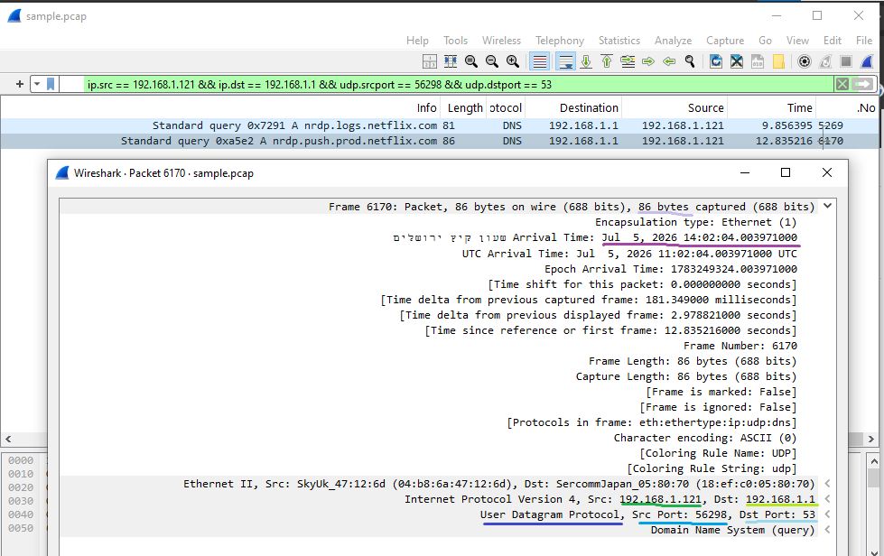
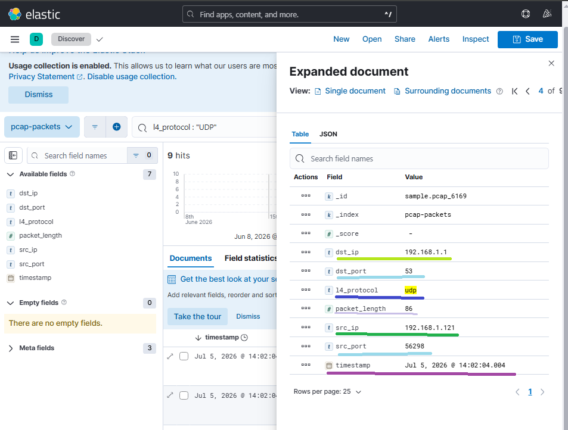

# 🌐 PCAP Analyzer Project

A comprehensive network traffic analysis system that transforms raw PCAP data into visual metrics, utilizing **Elasticsearch** and **Kibana** for data exploration, and **Prometheus** for real-time system monitoring.

---

## 📝 Project Description
A streamlined network analysis service that ingests PCAP files, parses individual packets to extract relevant metadata (such as IP addresses, ports, and protocols), indexes the data into **Elasticsearch** for investigation, visualizes traffic via **Kibana**, and exposes operational metrics to **Prometheus**.

### 🛠 Key Components
* **Python Analyzer**: An efficient engine for packet parsing and metric generation.
* **Observability Stack**: **Elasticsearch** (indexing), **Kibana** (visualization), and **Prometheus** (monitoring).
* **Environment**: A containerized **Docker Compose** setup for one-click deployment.

### ⚙️ System Optimization
* **Resource Management**: Elasticsearch memory is capped at 4GB to ensure system stability and peak performance within local development environments.

---

## 📊 Sample Data - PCAP File
The repository includes a `sample.pcap` file, which contains real-world Client-to-Cloud traffic from Netflix diagnostic services. The file consists of **8,567 packets**, categorized by our analyzer as follows:

* **TCP**: 172 packets
* **UDP**: 9 packets
* **ICMP**: 12 packets
* **OTHER**: 8,374 packets

---

## ⚙️ Environment Variables
The system behavior is controlled via environment variables defined in the `docker-compose.yml` file:

| Variable | Description | Default Value |
| :--- | :--- | :--- |
| `ELASTICSEARCH_HOSTS` | Kibana connection to ES | `http://elasticsearch:9200` |
| `ELASTIC_URL` | Analyzer connection to ES | `http://elasticsearch:9200` |
| `ELASTIC_INDEX` | Target index name | `pcap-packets` |
| `PCAP_PATH` | Path to PCAP file | `sample.pcap` |
| `MAX_PACKETS` | Max packets to process (0 for all) | `0` |
| `ELASTIC_MAX_RETRIES` | Max bulk write retries | `3` |
| `METRICS_PORT` | Prometheus port | `9100` |
| `METRICS_SERVER_TIMEOUT_SEC` | Metrics server timeout | `600` |
| `PYTHONUNBUFFERED` | Disable logs buffering | `1` |

---

## 🚀 How to Run

1. **Configure Environment**: Before starting, review the docker-compose.yml file to ensure all environment variables match your local environment requirement. 

2. **Deploy the environment**: Run the following command in the project root directory:
   ```bash
   docker compose up -d --build

3. **Verify logs**: To ensure the analyzer is running correctly, use:
   ```bash
   docker compose logs -f analyzer

### 🌐 Accessing the Services & Metrics
Once the containers are up, you can access the following services to monitor the system:

| Service | Port | Access URL | What to check/see? |
| :--- | :--- | :--- | :--- |
| **Kibana** | `5601` | http://127.0.0.1:5601 | Visualize packet data, search logs, and view traffic distribution. |
| **Prometheus** | `9090` | http://127.0.0.1:9090 | Verify the analyzer target is `UP` under *Status > Targets*. |
| **Metrics Endpoint** | `9100` | http://127.0.0.1:9100/metrics | View raw real-time metrics (counters and gauges). |

**Health Checks & Bulk Status:**

* You can verify that Prometheus metrics are being collected at `http://127.0.0.1:9100/metrics`.
* To monitor Elasticsearch ingestion success, check the `pcap_elastic_write_total` metric in the metrics endpoint. A healthy system will show a high success count (bulks) with minimal to zero failures.

**Verification with Wireshark:**

Validation: For deeper analysis, you can open the sample.pcap file in Wireshark. You can then compare the packet details (such as IP headers, ports, and protocol flags) visualized in Kibana against the raw packet structure captured in Wireshark. This ensures that the parsing logic in the Python Analyzer is accurate and that the data indexed in Elasticsearch reflects the actual network traffic.

## 📄 Example Document (Elasticsearch)
This is a sample JSON document representing a single processed packet, as stored in the `pcap-packets` index:

```json
{
  "_index": "pcap-packets",
  "_id": "sample.pcap_6169",
  "_version": 2,
  "_score": 0,
  "_source": {
    "timestamp": "2026-07-05T11:02:04.004Z",
    "packet_length": 86,
    "src_ip": "192.168.1.121",
    "dst_ip": "192.168.1.1",
    "src_port": "56298",
    "dst_port": "53",
    "l4_protocol": "udp"
  },
  "fields": {
    "src_ip": [
      "192.168.1.121"
    ],
    "src_port": [
      "56298"
    ],
    "packet_length": [
      86
    ],
    "src_port.keyword": [
      "56298"
    ],
    "dst_port": [
      "53"
    ],
    "l4_protocol": [
      "udp"
    ],
    "dst_ip.keyword": [
      "192.168.1.1"
    ],
    "dst_port.keyword": [
      "53"
    ],
    "src_ip.keyword": [
      "192.168.1.121"
    ],
    "l4_protocol.keyword": [
      "udp"
    ],
    "dst_ip": [
      "192.168.1.1"
    ],
    "timestamp": [
      "2026-07-05T11:02:04.004Z"
    ]
  }
}
```

## 🔍 Data Integrity Verification

To ensure the accuracy of our packet parsing, we compared a single packet's data between the raw PCAP capture (Wireshark) and the processed document in Elasticsearch (Kibana). As shown below, all fields are identical, confirming the analyzer's precision.

| Raw Packet (Wireshark) | Processed Data (Kibana) |
| :--- | :--- |
|  |  |

